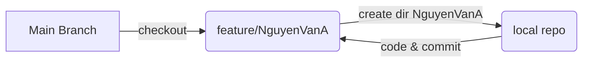

# Ansible-TOAA08
Ansible labs for Course TOAA08

## Description
This is the public repo that uses for students in class TEL4VN-TOAA01.Each student create a feature branch with name feature/Name-Of-Student and create a separate dir for each roles.

**Note:**  **Do not commit on master branch** 

This is example flow chart:



## How to contribute code
Please kindly remember that **DO NOT** commit on master branch. We should following steps below:

1. Clone repo to local machine by using command

```
    git clone https://github.com/vytran4love/Ansible-TOAA08 -> config user/password 
```
2. Checkout branch feature

```
    cd Ansible-TOAA08
    git branch
    git checkout -b "feature/NguyenVanA"
```
3. Add and commit code on branch feature

```
    git add -A
    git commit -m "Message you want to mark note"
```

4. Git push

```
    git push
```    
5. Make a PR to master branch

## Overall Folder Structure
Following is overall folder structrue

```
├── README.md
├── docs_example
│   ├── ansible.cfg
│   ├── group_vars
│   │   ├── all.yml
│   │   ├── nginx.yml
│   │   └── php.yml
│   ├── inventory
│   │   ├── dynamic_inventory
│   │   ├── local_inventory
│   │   └── static_inventory
│   ├── main.yml
│   ├── nginx.yml
│   └── php.yml
└── labs
```
